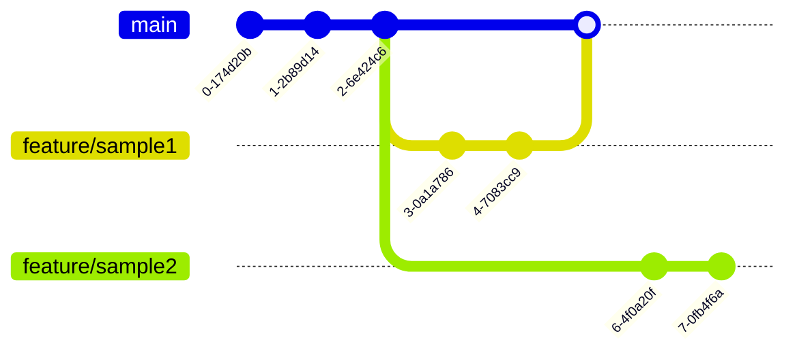

# はじめに
みなさん、Gitを正しく有効活用できていますか？
Gitっていつもいつも使う割には結構仕組みが複雑で分かりづらいところもありますよね。
そこで、この記事ではGitについて入門+αくらいの内容を解説していこうと思います。
また、今回使うのは**SourceTree**と**Unity**です。

# 環境
OS: Window11
Git: 2.50.0
Unity: 6000.0.41f1

# Gitとは？
まず、Gitとはなにかと、なぜ使うのかについて話をします。

Gitは**バージョン管理システム**とよく言われます。ちょっと難しい言葉なので分かりやすく例えると、**どんな作業をしたのかを記録できるシステム**です。
例えば、なにかファイルをつくりますよね。そして、それを変更します。そうすると、最新版は保たれますが古い状態は消えますよね。

そして、ここでさっきやった作業を消して元に戻したいとなってももう古い状態は消えているので戻せません。

じゃあ、そこで古いファイルもコピーして残しておけばいいのでは？と思うかもしれません。もちろん、それでもできるでしょう。
ですが、まず全てのファイルの管理をするのはおそらくとても大変だと思いますし、ヒューマンエラーをしてしまって消してしまうことや上書きしてしまう可能性もあります。
また、ファイル名のルールをきちんと決めていなければ、「〇〇.xlsx」「〇〇_最新版.xlsx」「〇〇_修正済み.xlsx」というようなどれが最新でどのように変更していったのかよくわからなくなってしまう可能性があります。

そこで出てきたのがこのバージョン管理システムで、開発されたのがこの**Git**です。

# GitHubとは？
Gitと一緒に聞くこの**GitHub**とはいったいなんなのでしょうか？

後で書きますが、**リモートリポジトリ**を扱うためのサービスのことです。
これを使うことで、さまざまな便利機能やチーム開発をすることができます。
現在のOSS(Open Source Software)と呼ばれるものはそのほとんどがGitHubで公開されています。
まあめちゃくちゃ便利なんで、この記事でも少し解説しますね。

# 本編
それでは、なぜGitを使った方がいいのかが理解できたところで、本題に入りましょう。
Gitでいうところのプロジェクトの意味を表す**リポジトリ**や、**コミット**などの用語と使い方を詳しく説明していきましょう。

# リポジトリとは？
リポジトリとは、簡単に言うとGit版プロジェクトのことです。

そして、このリポジトリには**ローカルリポジトリ**と**リモートリポジトリ**の２種類あります。

その２つのリポジトリとはなにかを説明します。


### ローカルリポジトリとは？
ローカルリポジトリとは、自分のPCの中にあるリポジトリです。
はい、ただただそれだけです。

基本的には、このローカルリポジトリの中で開発をしていきます。
リポジトリの設定なども基本ここでします。

ですので、この記事ではほとんどローカルリポジトリでの話になるでしょう。

### リモートリポジトリとは？
ローカルリポジトリとは違って、これはサーバなどに置いてあるリポジトリのことです。

基本はここを直接操作するということはほとんどなく、ローカルリポジトリで作業した内容をここにコピーすることになります。
よって、このリモートリポジトリは基本的に最新の状態が保持されます。

## リモートリポジトリの作成
それでは、リポジトリの作成をしていきましょう。
まず、一番最初に作成するのは **リモートリポジトリ** です。つまり、サーバに置いておくリポジトリのことですね。

そして、このリモートリポジトリの管理には **GitHub** というサービスを使うのが楽で便利なので、GitHubを使っていきましょう。
このGitHubでは、リモートリポジトリを **GitHub上** で作成することができます。

注意なのですが、GitHubアカウントは作成しているという前提で話をしていきます。

それでは、

[GitHub](https://github.com/)にアクセスしてください。

そして下の画像のように右にある緑色の **「New」** と書かれたボタンをクリックしてください。


こんな画面が出てきますよね。
ここで、今から作成するリポジトリの **設定** をしていきます。


### 1. リポジトリ名を決める
まず、リポジトリの名前を決めましょう。
後からでも変更することはできるのですが、あまりするのはよくなかったりするので今決めてしまいましょうか。

そうですね、今回はUnityのプロジェクトを作成するので **「practice-unity」** にでもしておきましょうか。

この画像のようになっていれば大丈夫です。


### 2. Description
ここではリポジトリの説明を書くことができます。正直あまり必要ないので今回はパスしておきます。

### 3. Choose visibility
この項目では、このリモートリポジトリが他の人から見ることができるかを設定することができます。
以下がその選択肢とその効果です。
- **Public**
このリポジトリを誰でも見ることができます。
- **Private**
このリポジトリはデフォルトで自分だけしか見ることができなくなります。もし他の人に見てもらったり、作業してもらいたかったら **招待する** ことでアクセスできるようになります。

今回は、とりあえず **「Private」** にしておきましょう。


### 4. Start with a template
リポジトリのテンプレートというのがあるのですが、今回は使用しないのでパスでいいです。

### 5. Add README
``README.md``というこのリモートリポジトリの説明をするための文章を書くことができるファイルを生成するか？という設定です。

この画像のように、このリポジトリのセットアップ方法などの情報を書くのに使います。または、開発者のメモのようにも使うことができます。


つくらないでも、あとで **「README.md」** をリポジトリ直下に作成すればいいので問題ないのですが、とりあえず今回はつくっておきましょう。

ですので、画像のように **「On」** にしておきましょう。


### 6. Add .gitignore
この項目では、 ``.gitignore`` というファイルを作成するか？というものです。

この「.gitignore」についてはあとで解説するのですが、簡単に言うとリポジトリに含めないファイルを指定するためのファイルです。
例えば、キャッシュ(一時ファイル)など実行するための時間を早くするためのファイルや個人のツールの設定などの、プロジェクトにはそこまで関係のないけど自動で生成されるファイルをリポジトリに含めないようにするのに使います。

そして、Unityでもプロジェクトに直接関係のないファイルを大量に生成するのでこれが必要になります。

Unity用の.gitignoreファイルのテンプレートがあるのでそれを使いましょう。

下の画像のように、「No .gitignore」ボタンをクリックして、「unity」と検索すると「Unity」が出てきますので、それを選択しましょう。


### 7. Add license
ライセンスをつけるかという設定です。
まあ、今回はなくてもいいでしょう。
そのままにしておいて大丈夫です。

### 8. Create Repository
それでは設定ができたので、最後に「Create Repository」というボタンを押しましょう。

これでリモートリポジトリを作成できました！


## ローカルリポジトリの作成
次にローカルリポジトリを作成しましょう。

やり方は簡単で、リモートリポジトリからコピーします。

この作業を **クローン** というので覚えておいてください。

では実際にしていきましょうか。

SourceTreeを開いてください。
そして、下の画像のように「クローン」をクリックしてください。


GitHubのリポジトリのURLを、画像のようにペーストしてください。
それで、**「クローン」**をクリックしましょう。


これで、自分のPC上にGitHubのリモートリポジトリがコピーされました。
そして、この自分のPC上のリポジトリを**ローカルリポジトリ**といいます。

基本的には、このローカルリポジトリ内で作業をして、逆にリモートリポジトリに作業内容をコピーすることでリモートリポジトリは最新の状態に保つことができます。

## ローカルリポジトリの設定
それでは、ローカルリポジトリを作成しただけでここにはUnityのプロジェクトが入っていないので、今から入れていきましょう。

この画面のように、とりあえずUnityのプロジェクトをつくってもらうのですが、この際に**クローンしたフォルダ内でプロジェクトをつくらないようにしてください！**
それ以外の場所なら基本どこでも大丈夫です。


プロジェクトの作成ができましたね。


これで、GitのローカルリポジトリとUnityのプロジェクトは作成できたので、そのリポジトリにUnityのプロジェクトを入れましょう。
入れ方は簡単で、リポジトリのフォルダの中にプロジェクトを入れてしまうだけでいいのですが、ここで少し注意があります。

それはフォルダ階層です。

結論から言うと、**「Unityのプロジェクトフォルダの中身をリポジトリのフォルダに入れる」**です。
まあ、とりあえず入れてみましょうか。

Unityのプロジェクトフォルダはこんな感じですね。


では、この中身を全て選択してコピーしてください。


これがリポジトリですね。


ここに、さっきコピーしたのをペーストしましょう。
たぶん結構時間がかると思うので、ちょっと待ちましょう。

完了したら、このような画面になっていると思います。


では、ここでなぜこのフォルダ階層にしないといけないのかお話します。

リポジトリの中に、`.gitignore`というファイルがありますよね。
このファイルには、Gitのリポジトリに含まないファイルを記述します。つまり、リポジトリのフォルダの中にあったとしても、このファイルに書かれているフォルダはリポジトリには含まないという意味です。
では、中身を少しのぞいてみましょう。
```
# This .gitignore file should be placed at the root of your Unity project directory
#
# Get latest from https://github.com/github/gitignore/blob/main/Unity.gitignore
#
.utmp/
/[Ll]ibrary/
/[Tt]emp/
/[Oo]bj/
/[Bb]uild/
/[Bb]uilds/
/[Ll]ogs/
/[Uu]ser[Ss]ettings/
*.log

# By default unity supports Blender asset imports, *.blend1 blender files do not need to be commited to version control.
*.blend1
*.blend1.meta

# MemoryCaptures can get excessive in size.
# They also could contain extremely sensitive data
/[Mm]emoryCaptures/

# Recordings can get excessive in size
/[Rr]ecordings/

# Uncomment this line if you wish to ignore the asset store tools plugin
# /[Aa]ssets/AssetStoreTools*

# Autogenerated Jetbrains Rider plugin
/[Aa]ssets/Plugins/Editor/JetBrains*
# Jetbrains Rider personal-layer settings
*.DotSettings.user

# Visual Studio cache directory
.vs/

# Gradle cache directory
.gradle/

# Autogenerated VS/MD/Consulo solution and project files
ExportedObj/
.consulo/
*.csproj
*.unityproj
*.sln
*.suo
*.tmp
*.user
*.userprefs
*.pidb
*.booproj
*.svd
*.pdb
*.mdb
*.opendb
*.VC.db

# Unity3D generated meta files
*.pidb.meta
*.pdb.meta
*.mdb.meta

# Unity3D generated file on crash reports
sysinfo.txt

# Mono auto generated files
mono_crash.*

# Builds
*.apk
*.aab
*.unitypackage
*.unitypackage.meta
*.app

# Crashlytics generated file
crashlytics-build.properties

# TestRunner generated files
InitTestScene*.unity*

# Addressables default ignores, before user customizations
/ServerData
/[Aa]ssets/StreamingAssets/aa*
/[Aa]ssets/AddressableAssetsData/link.xml*
/[Aa]ssets/Addressables_Temp*
# By default, Addressables content builds will generate addressables_content_state.bin
# files in platform-specific subfolders, for example:
# /Assets/AddressableAssetsData/OSX/addressables_content_state.bin
/[Aa]ssets/AddressableAssetsData/*/*.bin*

# Visual Scripting auto-generated files
/[Aa]ssets/Unity.VisualScripting.Generated/VisualScripting.Flow/UnitOptions.db
/[Aa]ssets/Unity.VisualScripting.Generated/VisualScripting.Flow/UnitOptions.db.meta
/[Aa]ssets/Unity.VisualScripting.Generated/VisualScripting.Core/Property Providers
/[Aa]ssets/Unity.VisualScripting.Generated/VisualScripting.Core/Property Providers.meta

# Auto-generated scenes by play mode tests
/[Aa]ssets/[Ii]nit[Tt]est[Ss]cene*.unity*
```

このように、ファイルのパスがずらずらと記述されているんです。
そして、リポジトリの構成もこの`.gitignore`ファイルに対応させなければいけません。
このファイルを見る限り、Unityのプロジェクト全体のフォルダは記述されてないですよね？
そのため、その中身をコピーしてペーストしました。

とりあえず、これでリポジトリの初期設定は大丈夫です。

# コミットをする
それでは、ようやく本題ともいえる操作をしていきましょう！！

**コミット(commit)** です！

このコミットという操作はGitを扱う上でとても重要なのできちんと理解しておきましょう！

Gitはバージョン管理システムであるという話をしましたが、このコミットはそのバージョン(リポジトリの状態)を記録する機能です。
そこで、少し注意してほしいのが、コミットはファイルの状態を完璧に記録しているのではなく、**前回から何が増えて何が減ったか** を記録しているんです。

例えば、こんなファイルを新規作成したとします。
```c#
class Sample : MonoBehavior
{
    void Start()
    {
        Debug.Log("Hello, world!!");
    }
}
```

これで１回コミットします。そうすると、ファイルを新規作成してコードを記述したという記録が残ります。

次に、このファイルを編集して
```c#
class Sample : MonoBehavior
{
    void Start()
    {
        Debug.Log("Hello, world!!");
        Debug.Log("Hello, Unity!");
    }
}
```
こうします。
``Debug.Log("Hello, Unity!");``の分だけ増やしました。
これでコミットをします。

そうすると、その````Debug.Log("Hello, Unity!");```` が追記されたという記録がされます。
実は、そのファイル全体を毎回記録しているというわけではなく、どれだけ変更されたかという**差分** を記録しているんです。

例えばですね、先ほどのコードから、
```c#
class Sample : MonoBehavior
{
    void Start()
    {
        Debug.Log("Hello, Unity!");
    }
}
```
このように編集したとします。
ここでコミットをすると、`Hello, world!!`が削除されたという記録になります。

さらに、
```C#
class Sample : MonoBehavior
{
    void Start()
    {
        Debug.Log("Hello, Unity Project!");
    }
}
```
このように変更したとします。
これでコミットをすると、`Debug.Log("Hello, Unity!");`が削除されて、`Debug.Log("Hello, Unity Project!");`が追加されたという記録になります。

こんな感じで、コミットの概念は理解できたでしょうか？この概念は、細かいようで結構大切なのできちんと理解しておくと色々と便利だと思います。

それでは実際にコミットしてみましょう！

SourceTreeの「ファイルステータス」をクリックしてください。


このように、Unityのプロジェクトを作成したのでその変更点が表示されていますね。

このままではコミットはできません。
コミットをする前に、**どのファイルのどの変更点をコミットするかを選択する** 必要があります。
この作業を **「ステージング」** といいます。
これにより、柔軟なコミットができます。

それではステージングをしましょうか。
今回は全てのファイルを含めていいので、**「全てインデックスに追加」** をクリックしてください。


これで全てのファイルをステージングできたので、コミットをしましょう。
コミットをするには、**「コミットメッセージ」** をつけなければいけません。
これは、どのようなコミットなのかを簡単に説明する文章のようなものです。
まあ、基本は自由でいいのですが、一応推奨されるコミットメッセージのルールみたいなものもあります。
[Conventional Commits](https://www.conventionalcommits.org/ja/v1.0.0/) というサイトがあってここに記述されているのでぜひ参考にしてみてください。

それではコミットしましょうか。
コミットメッセージは、`feat: プロジェクトの初期化`にしましょうか。
画像のように入力して、**「コミット」** を押してください。


「履歴」をクリックしてみると、このようにコミットのログを見ることができます。
これを **「コミットログ」** と言います。
よく見てみると、先ほどコミットした`feat: プロジェクトの初期化`がありますね。つまり、コミットは正常にできているということです。


# プッシュ
それでは、**ローカルリポジトリでコミット** ができたので、次はその変更を**リモートリポジトリに反映させましょう。**
基本的にリモートリポジトリを直接操作することはあまりなく、このようにローカルリポジトリの変更を反映させるという段階を踏みます。

そして、この操作のことを **「プッシュ」** といいます。

このプッシュでは、先ほどつくったコミットをリモートリポジトリにコピーします。
つまり、なにを追加したか、削除したかなどの情報をコピーするんですね。

それでは、実際にやってみましょう。

画像のように、上の方に「プッシュ」というボタンがあるのでそれを押してください。


そうするとウィンドウが出てくるので、今はなにもせずにそのまま「プッシュ」を押してください(のちのちここでも色々操作をします)。


GitHubのページを確認してみましょう。そうすると、反映されていると思います。


これで、とりあえず一番単純な開発の方法を学ぶことができました！
次からは、便利な機能や共同開発をする上では不可欠な機能について勉強していきましょう！

# ブランチ
Gitには**ブランチ** という機能があります。
これは、個人開発でもそうですし共同開発になると必須になる機能なので、ぜひ覚えましょう。

ブランチとは、簡単にいうと**開発の流れ** のことです。
そして、すでに私たちは使っているんです。

SourceTreeを見てみましょうか。

少し小さいですが、`main`と書いてあるところがありますよね。これがブランチです。


つまり、私たちは`mainブランチ`で作業をしていたんです。

そしてこのブランチは途中で切ることができます。

現在、mainブランチで作業をしていますが、そこからブランチを切る(ブランチを作成する)ことで、その状態を引き継ぎつつmainブランチをそのまま保った状態で作業をすることができます。
そして、作業が終わるとmainブランチに自分が作成したブランチを反映させることでmainブランチを最新の状態に保つことができるんです。

なぜこのような複雑な操作をするのか、と思うかもしれませんが、以下のようなメリットがあります。
- 作業の途中でやり直したくなった時、自分のブランチを削除するだけでいい。
- 他の人にチェックをしてもらってからmainに反映させることができる。
- 同じファイルを複数の人が作業した時、状態の整合性が取れなくなってしまっても修正がやりやすい。

など、いろいろあります。
とりあえず、mainブランチで直接作業をするのではなく**ブランチを作成してから作業をする** ということをきちんと覚えておいてください。

では、実際に作業をしてみましょう。

ブランチというボタンがあるのでそれをクリックしましょう。


そうするとこのようなウィンドウが出てきます。
ブランチの名前を設定しなければいけないので、今回は`feature/show_log`にしましょう。
正直名前は何でもいいです。結構適当で大丈夫です。
その後、「ブランチを作成」ボタンを押しましょう。
これで、ブランチの作成ができます。


それでは、少しUnityの作業をしましょう。
今回はメインがGitについてなのでUnityの詳しい操作についての説明は省きます。

それでは、この順番に作業をしてくださ。
1. Assets直下に`Scripts`フォルダを作成
2. `Scripts`直下に`ShowLog.cs`作成
3. 以下のスクリプトを記述
```C#
using UnityEngine;

public class ShowLog : MonoBehaviour
{
    // Start is called once before the first execution of Update after the MonoBehaviour is created
    void Start()
    {
        Debug.Log("Game Start!");
    }

    // Update is called once per frame
    void Update()
    {
        
    }
}
```

4. Hierarchyで、`ShowLog`というEmpty Objectを作成
5. ShowLogオブジェクトに`ShowLog.cs`をコンポーネント

これで実行してみてください。
実行したときに、ログに`Game Start!`と出力されれば大丈夫です。

では、これでSourceTreeを開きましょう。
色々変更点が表示されていたら大丈夫です。


この変更点を全てコミットしましょう。
コミットメッセージも自由で大丈夫です。

私は、`feat: スタート時ログを表示` にでもします。


次に先ほどと同じように**プッシュ** をしましょう。
先ほどと同じ手順でしてみてください。

どうですか？うまくいきましたか？

はい、そうですね。うまくいかないですよね。

なぜうまくいかないかと言うと、実はこの操作ではなにもプッシュできていないからです。
そもそもプッシュというのは**ブランチをプッシュする** というもので、本来はそのブランチを設定しなければいけないんです。
例外として、mainブランチや直前にプッシュしたブランチなどいろいろ条件があるのですが、デフォルトで設定されていることもあります。

ですが、今回は`feature/show_log`ブランチで作業をしていますので、`feature/show_log`ブランチをプッシュしなければいけません。
そのため、自分でこのブランチをプッシュするように指定しましょう。

先ほどと同じように、プッシュボタンを押してください。


`feature/show_log`ブランチがあると思いますが、その左のチェックボックスにチェックを入れましょう。
すると、「リモートブランチ」という欄にも同じブランチ名が書かれます。
つまり、`feature/show_log`ブランチをリモートリポジトリ上で`feature/show_log`ブランチを作成してそこにプッシュをするという意味になります。

これで、プッシュを押してください。


これで、一応はローカルリポジトリからリモートリポジトリにプッシュはできました。
ですが、まだmainブランチには反映されていませんよね。

次はその反映させる作業をしていきましょう。

# マージ
先ほどの作業で`feature/show_log`ブランチのプッシュはできました。
次はそのブランチをmainブランチに反映させましょう。

そして、この反映させる作業を **「マージ」**といいます。覚えておいてください。

GitHubのリモートリポジトリを見てみましょう。
そうすると、画像のように **「Compare & pull request」** という緑色のボタンがあります。
これをクリックしてみましょう。


このような画面が出てきました。


これは、**「Pull Request」** というものです。よくプルリクって言うと思うのですが、それです。
ここには、プッシュしたブランチではどんな作業をしたのか、どんな変更点があったのかを記述することができます。

この画面でも自分がどのファイルでどんな作業をしたのかを見ることもできます。

では、適当に書いてみましょうか。
まあ基本は自由です。文法は`Markdown`という記法を使うのですが、分からなかったら普通に文章を書いてもらって大丈夫です。
私はこんな感じに書いてみました。

```markdown
- [x] スタートした時、`Game Start!`とログに表示する
```


それでは、下にある緑色の「Create pull request」をクリックしてください。

そうすると、こんな画面になりますね。
これで、プルリクの作成はできました。
ちなみに、このプルリクを作成した状態でも同じブランチを使って作業をしてからプッシュするとそれが反映されます。


もう少し下の方に、緑色で「Merge pull request」というボタンがあります。
このボタンを押すことでmainブランチに**マージ** をすることができます。
つまり、変更をmainブランチに反映させることができます。


そこで、少し思ったのではないでしょうか。
そもそもこんなの使わずにマージすればよくね？と。
はい、もちろん手動で直接マージすることはできます。

ですが、プルリクを作成することによるメリットが実はたくさんあります。

例えば、その作業内容自体にバグがあった場合どうでしょうか？
共同開発をしていて、自分がmainに直接マージをしたとします。ですが、そこにバグがあったとしましょう。
そうすると、mainブランチの最新の状態にバグが入ってしまい、これが他の人にも影響されてしまいます。

それが起きないように、このプルリクを使えば、他の人にレビューをしてもらうということができます。
また、最近はAIにレビューをしてもらうこともできます。
ちなみに、このレビューを**コードレビュー** と言います。

このコードレビューをしてもらって、他の人から承認が下りればマージをすることでそのような事故を防ぐことができます。

また、これ以外にもプルリクはコミットとして記録されるので、後から見直してどんな作業をしたのか見返しやすいというメリットもあります。

このように色々なメリットがあるのでプルリクを作成するんですね。

では、今回は1人しかいないので、とりあえずマージしてしまいましょうか。

「Merge pull request」ボタンをクリックしてください。
その後、「Confirm merge」もクリックしてください。

そうすると、このような画面になります。
「Delete branch」というボタンが出てきましたね。これを押すと、先ほどの`feature/show_log`ブランチを削除することができます。
もう使ってしまったのでいらないですよね。
私はいつもこれを押して、削除してしまいます。
残す意味ってあまりないので。


これでマージ完了です。

# プル
それでは、これで自分の作業をmainにマージすることができました。
ですが、これは**リモートリポジトリ上でマージした** だけなので、これを自分のローカルリポジトリに反映させましょう。

この操作を **「プル」** といいます。

SourceTreeでmainブランチを開きます。

ブランチの中に、`main`と書いてある場所があるので、それをダブルクリックしてください。


プルと書いてあるボタンがあるので、それをクリックしましょう。
ウィンドウが出てくるので、それも「OK」を押してください。


そうすると、この画像のように反映ができたことが確認できると思います。
この際、mainブランチから`feature/show_log`を作成して、mainブランチにマージをしているのが表示されていますよね。
こうなっていれば大丈夫です。


今回は1人での作業でしたが、これは他の人が作業をしたときも同じです。
例えば、mainブランチからブランチを作成する前に他の人がmainにその人の作業内容をマージしていたとしましょう。
それを反映させるためには、ブランチを作成するために、一度mainブランチを**プル** しておかなければいけません。

つまり、開発のフローとしては、
1. mainブランチをプル
2. ブランチを作成
3. コミット
4. プッシュ
5. プルリクの作成
6. マージ(コードレビューがあればその後)

になります。これを基本的には守ってください。

# Conflict

## Conflictを起こす
次に**Conflict** という現象について話をしましょう。
では、とりあえず意図的にそれを起こしてみましょうか。

まず、`fix/change_log1`というブランチと`fix/change_log2`というブランチを作成してください。
どちらも**mainブランチから** 作成してください。

これは、つまり**2人が作業を同じタイミングで始めてブランチを作成した** ことを疑似的に表しています。

このような状態になれば大丈夫です。


では、まずは最初`fix/change_log1`ブランチで作業をしましょう。

先ほどのコードを少し変更してください。
```c#
using UnityEngine;

public class ShowLog : MonoBehaviour
{
    // Start is called once before the first execution of Update after the MonoBehaviour is created
    void Start()
    {
        Debug.Log("Start!");
    }

    // Update is called once per frame
    void Update()
    {
        
    }
}
```

`Debug.Log()`のところを変更しました。
では、これを同じように、
1. コミット
2. プッシュ
3. プルリク作成
4. マージ

をしてください。
メッセージとか内容とかは自分で決めてくださいね。

こんな状態になれば大丈夫です。


これで、mainはプルしなくて大丈夫です。
つまり、これは１人が作業が完了してmainにマージしたということを疑似的に表しています。

では、もう一つの`fix/change_log2`に切り替えましょうか。
そして、先ほどのスクリプトを
```c#
using UnityEngine;

public class ShowLog : MonoBehaviour
{
    // Start is called once before the first execution of Update after the MonoBehaviour is created
    void Start()
    {
        Debug.Log("Game Scene Start!");
    }

    // Update is called once per frame
    void Update()
    {
        
    }
}
```
にしてください。
こちらも同じように`Debug.Log()`の中身を変更しました。

それでは同じようにコミットとプッシュしてプルリクを作成するところまで作業してください。

こうなります。


もうちょっとよく見てみると、先ほどと違う箇所がありますよね。

`This branch has conflicts that must be resolved`って書いてあります。


そう、これが **「Conflict」** とい現象です。

私たちがした作業をいったんまとめましょう
- mainブランチを２つ作成
- 1つめで作業をして、mainブランチにマージ
- 2つ目で、1つ目の作業内容を含めない状態での作業をしてマージ

こうですね。
つまり、２つ目のブランチでは１つ目のブランチの変更がないので、
```diff
-        Debug.Log("Game Start!");
+        Debug.Log("Game Scene Start!");
```
このようなコミットになります。(`-`は削除で、`+`は追加を表しています。)

ですが、mainブランチにはすでに１つめのブランチの変更が反映されていますので、
```c#
        Debug.Log("Start!");
```
ですよね。

つまり、Gitの気持ちになってみると、
- 「`Game Start!` -> `Game Scene Start!`に変更しろ」

と言われているのに、元は`Start!`だから、つじつまが合わない！！！どうしよう！！となっているんです。

では、これを解決しましょう。

## Conflictを解決する
解決する方法は簡単です。

自分がプッシュしたブランチに、mainブランチを反映(マージ)してあげて、そこでも同じようにConflictが起きてしまうので、手動で直してあげればいいんです。

よくわからないですよね。少しずつやってみましょう！

### 1. mainをプル
とりあえず、mainの最新の状態をプルしましょう。

mainに切り替えて、プルボタンでプルしてください。


### 2. マージする
次に、作業中のブランチに戻ってからmainをマージします。

気を付けてほしいのが、普段は**mainにマージ** していたのですが、今回は、**mainをマージ** します。
結局マージって合わせる作業なので、どっちからやっても結果は変わらないんですね。

まず`fix/change_log2`ブランチにもどってから、

mainブランチを右クリックしてください。
その後、「現在のブランチにメインをマージ」というボタンを押してください。


次のウィンドウで「OK」を押してください。

そうすると、こんなウィンドウが出てきたのではないでしょうか？
これはGitHubと同じように、コンフリクトしちゃったから直してねってことです。


「閉じる」ボタンを押すと、自動でこの画面に来ます。


なんかあまり見慣れない記号がついていますよね。
そうです。これがコンフリクトしたという記号です。


では、このファイルを開いてみましょう。

```c#
using UnityEngine;

public class ShowLog : MonoBehaviour
{
    // Start is called once before the first execution of Update after the MonoBehaviour is created
    void Start()
    {
<<<<<<< HEAD
        Debug.Log("Game Scene Start!");
=======
        Debug.Log("Start!");
>>>>>>> main
    }

    // Update is called once per frame
    void Update()
    {
        
    }
}
```
こんな感じで、ちょっと書き加えられています。

これは、
```
<<<<<<< HEAD
// 新しいブランチでの変更
=======
// mainブランチを状態
>>>>>>> main
```
このような意味です。
そして、これのどちらかにするか新しく書いてしまってもいいです。
まあそうですね、今回は新しいブランチの方を優先しましょう。

手動で書き換えて、
```c#
using UnityEngine;

public class ShowLog : MonoBehaviour
{
    // Start is called once before the first execution of Update after the MonoBehaviour is created
    void Start()
    {
        Debug.Log("Game Scene Start!");
    }

    // Update is called once per frame
    void Update()
    {
        
    }
}
```
こうしてください。
そして、SourceTreeを開いてください。
その後の操作は同じで、変更をしたファイルをステージングをしてコミットをします。
なお、この際コミットメッセージはすでに書かれているので、それを使うといいと思います。

それでは、そのままプッシュをしてください。

そしてGitHubのプルリクの画面を開いてください。
画像のようにマージできるようになっていると思います。


これでマージをしてください。

:::message
#### コンフリクトを直すには？
新しいブランチ上で、mainにマージしてコンフリクトした状態を手動で作り出し、それを直す。
その状態で、プッシュするとmainにマージできるようになる。
(なぜなら、コンフリクトを起こして直した状態でプッシュをしたため)
:::

# rebase
次に、**rebase** という機能について解説しますね。
これはマージと少し似ていますが、コミットの履歴を綺麗に保つことができるメリットがあります。

## マージの悪いところ


このような状況になっていると想定します。

これで、`feature/rebase2`をmainにマージしようとしたとき、コンフリクトする可能性がありますよね。

そこで、マージを先に使うといいという話をしました。


このような流れです。
ですが、正直言って、ここには２つの無駄なコミットが生成されています。
- マージコミット
- コンフリクト解決コミット

この不要なコミットを生成しないような仕組みがこのリベースというものです。

## リベースの仕組み
リベースは、**自分のブランチのコミットを指定したブランチのコミットの上に乗せてしまう**という機能です。

よく分からないと思いますので、例で解説しましょう。


先ほどと同じ状況です。
では、今回はマージをするのではなく、`feature/sample2`に`main`を**リベース** してみましょう。

そうすると、


このような状態になります。
